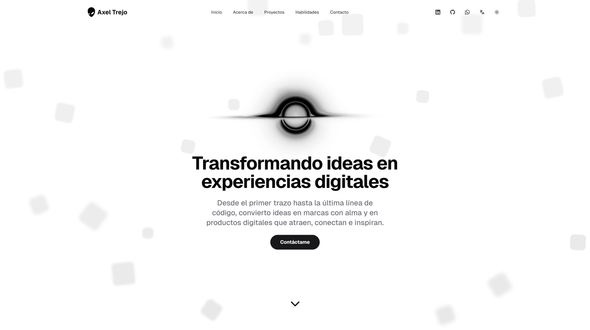

<h1>Sitio Web Personal</h1>

<a href="./README.md">📝 Read in English</a>

---

Este repositorio contiene el código fuente de mi [sitio web personal](https://axeltrejo.com/es). Es un portafolio moderno, optimizado para desarrolladores, diseñado con un enfoque en **accesibilidad** y **experiencia del usuario**.

Este proyecto está construido con una combinación de tecnologías modernas. Se eligió **Next.js** para aprovechar sus capacidades de optimización y despliegue, mientras que **React** permite estructurar las interfaces de manera modular e interactiva. **TypeScript** se usa para mejorar la mantenibilidad y escalabilidad del código, y **Tailwind** agiliza la creación de un diseño consistente y adaptable.

Para la experiencia del usuario, se utiliza **Radix UI** por sus componentes accesibles y fáciles de personalizar, junto con **Motion** para añadir animaciones fluidas. **Lucide** aporta íconos claros y modernos, **Resend** facilita el envío de correos electrónicos y **Zod** garantiza una validación confiable de los datos.

<h2>Captura de Pantalla</h2>
<a href="https://axeltrejo.com/es">
<picture>
<source media="(prefers-color-scheme: dark)" srcset="./assets/screenshot/es-light.svg">
<source media="(prefers-color-scheme: light)" srcset="./assets/screenshot/es-dark.svg">

</picture>
</a>

