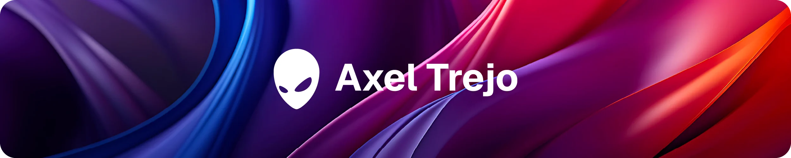
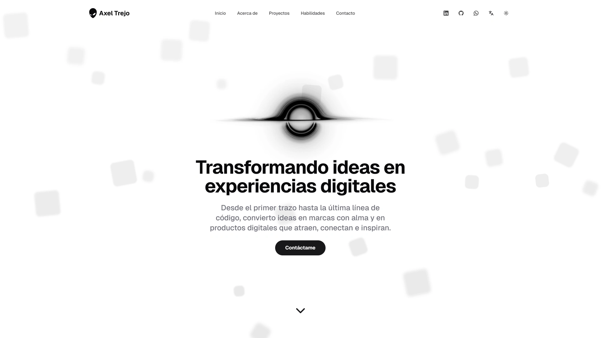

<h1>Sitio Web Personal</h1>

<a href="./README.md" style="margin-top: 12px; margin-bottom: 6px;">📝 Read in English</a>

---

Este repositorio contiene el código fuente de mi [sitio web personal](https://axeltrejo.com/es). Es un portafolio moderno, optimizado para desarrolladores, diseñado con un enfoque en la accesibilidad y la experiencia del usuario.

Construido con tecnologías de última generación como **Next.js**, **React**, **TypeScript** y **TailwindCSS**, este proyecto refleja tanto mi estilo de desarrollo como mis habilidades técnicas. También integra herramientas modernas como **Radix UI**, **Framer Motion**, **Lucide Icons**, **Resend** y **Zod** para crear una experiencia más rica, interactiva y mantenible.

<a href="https://axeltrejo.com/es">
<picture>
<source media="(prefers-color-scheme: dark)" srcset="./assets/screenshot/es-light.webp">
<source media="(prefers-color-scheme: light)" srcset="./assets/screenshot/es-dark.webp">

</picture>
</a>
