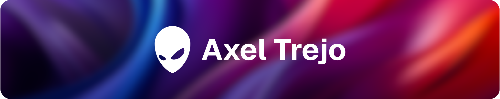
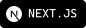
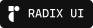
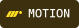
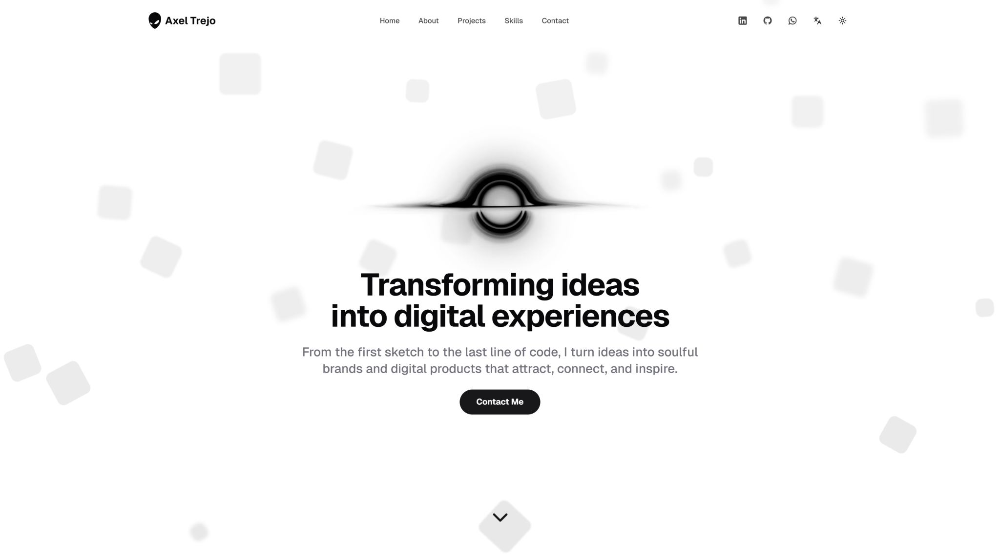

<h1>Personal Website</h1>

<a href="./README.es.md">📝 Leer en Español</a>

---

This repository contains the source code of my [personal website](https://axeltrejo.com/en). It is a modern portfolio, optimized for developers, designed with a focus on **accessibility** and **user experience**.

This project is built with a combination of modern technologies. **Next.js** was chosen to take advantage of its optimization and deployment capabilities, while **React** allows for modular and interactive interface structuring. **TypeScript** is used to improve code maintainability and scalability, and **Tailwind** streamlines the creation of a consistent and responsive design.

For the user experience, **Radix UI** is used for its accessible and easy-to-customize components, along with **Motion** to add smooth animations. **Lucide** provides clean and modern icons, **Resend** facilitates email delivery, and **Zod** ensures reliable data validation.

<h2>Screenshot</h2>
<a href="https://axeltrejo.com/en">
<picture>
<source media="(prefers-color-scheme: dark)" srcset="./assets/screenshot/en-light.svg">
<source media="(prefers-color-scheme: light)" srcset="./assets/screenshot/en-dark.svg">

</picture>
</a>

