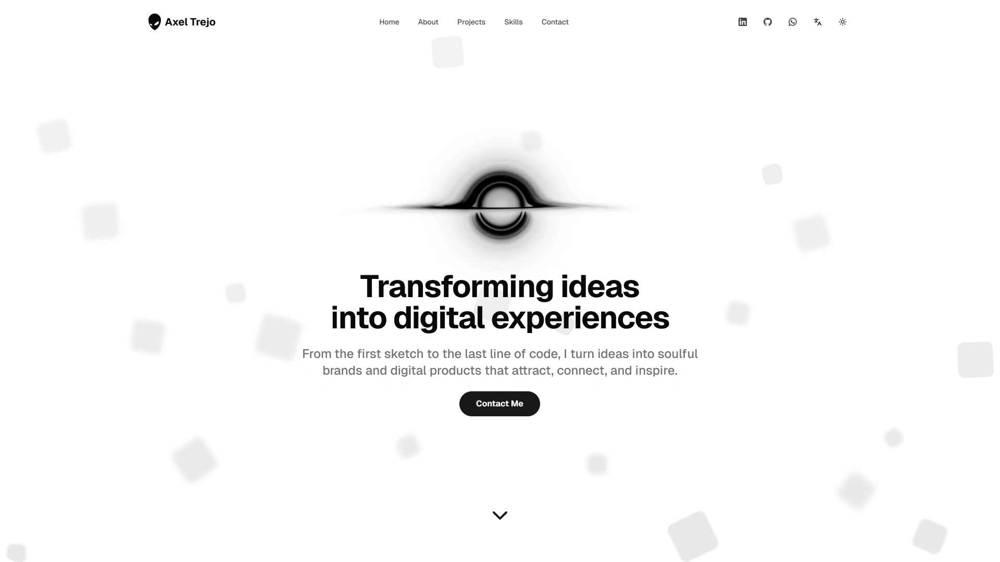

<h1>Personal Website</h1>

<a href="./README.es.md" style="margin-top: 12px; margin-bottom: 6px;">📝 Leer en Español</a>

---

This repository contains the source code of my [personal website](https://axeltrejo.com/en). It is a modern, developer-optimized portfolio designed with a focus on accessibility and user experience.

Built with cutting-edge technologies like **Next.js**, **React**, **TypeScript**, and **TailwindCSS**, this project reflects both my development style and technical skills. It also integrates modern tools such as **Radix UI**, **Framer Motion**, **Lucide Icons**, **Resend**, and **Zod** to create a richer, more interactive, and maintainable experience.

<a href="https://axeltrejo.com/en">
<picture>
<source media="(prefers-color-scheme: dark)" srcset="./assets/screenshot/en-light.webp">
<source media="(prefers-color-scheme: light)" srcset="./assets/screenshot/en-dark.webp">

</picture>
</a>
